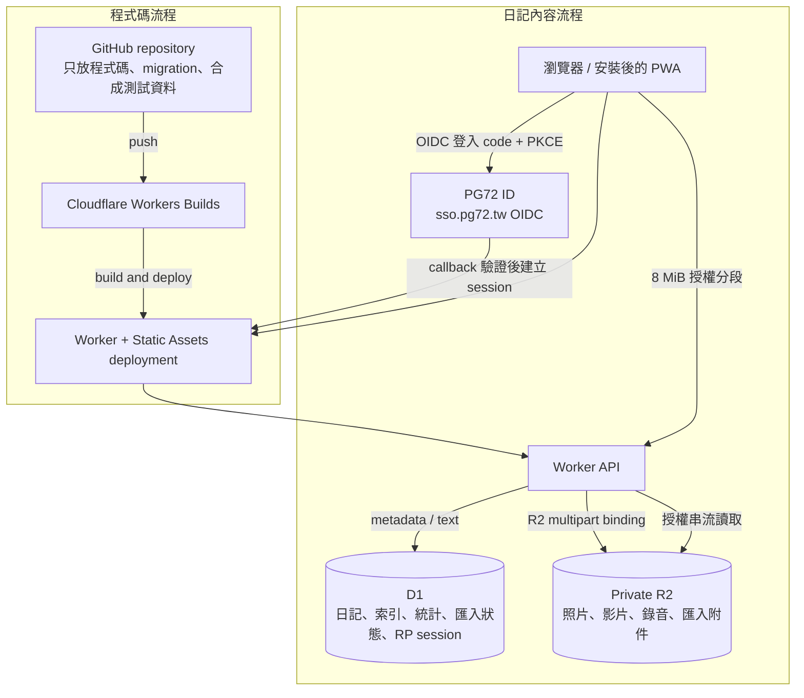
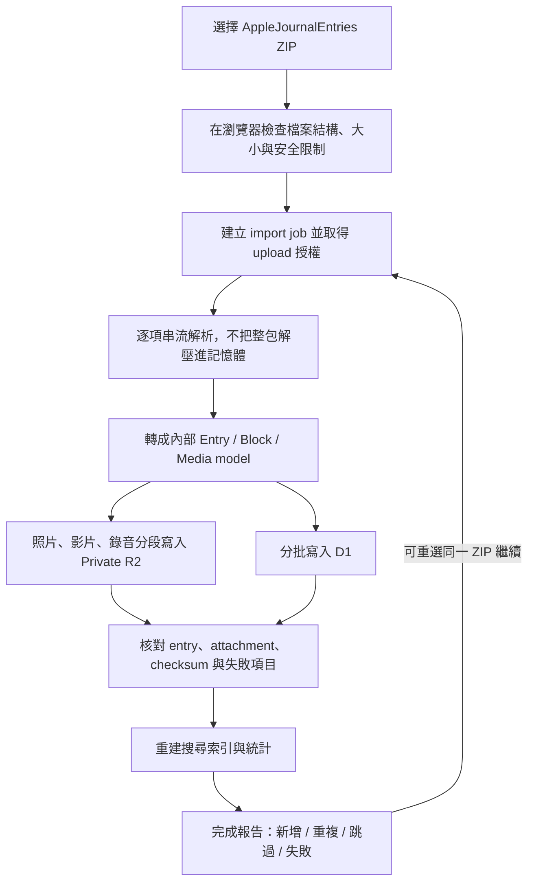

# PG72 Diary

一個以「回看人生」為核心的私人線上日記：可一鍵匯入 Apple Journal，保留照片、影片、錄音、位置與版面關係，並用有個性的動態時間軸呈現內容。

> 專案狀態：開發中。本文是產品與技術規格，研究日期為 2026-07-15。

## 目前進度

第一個可執行的 vertical slice 已完成：

- React + Vite + Cloudflare Workers full-stack scaffold
- D1 migration：journals、entries、blocks、media、tags、imports、FTS5 與必要索引
- Overview API、timeline API、entry detail API 與 private R2 streaming route
- Overview、動態時間軸、日曆、Places、Insights、搜尋與 entry 閱讀視窗
- 文字日記的新增、編輯、刪除（soft delete 可復原）與附件上傳/移除管理
- Apple Journal HTML ZIP 解析、內容預覽、逐篇 D1 upsert、可續傳 R2 multipart 媒體上傳與重複匯入去重
- 空白 seed；合成 Apple Journal fixture 只存在隔離的 E2E state
- Workers runtime tests、type-aware ESLint、production build 與 Playwright desktop/mobile workflows

日記採「公開唯讀、私人寫入」：任何人都能瀏覽日記內容，但所有 mutation（新增、匯入、上傳）需要 PG72 ID（自建 OIDC SSO，`sso.pg72.tw`）登入——Worker 驗證 Authorization Code + PKCE 流程與 EdDSA ID token 後建立自己的 D1 server-side session，並只允許設定檔中 allowlist 的擁有者 `sub`。`localhost` 開發環境維持免登入 bypass（本機 D1 屬於使用者自己）。匯入器已支援目前已知的 `Entries/*.html` + `Resources/` 結構，更多 Apple export 變體仍需真實但去識別化的 fixture 驗證。

## 本機開發

需要 Node.js 22+ 與 pnpm 11.5。

```bash
pnpm install
pnpm run db:migrate:local
pnpm run db:seed:local
pnpm dev
```

開發站預設位於 `http://127.0.0.1:5173/`。D1 與 R2 使用 Wrangler 的本機模擬資料，不會接觸 production。

完整驗證：

```bash
pnpm run check
pnpm test
pnpm run test:e2e # 使用獨立的 .wrangler/e2e-state，不會修改日常本機資料
pnpm build
```

## 產品原則

1. **日記是資料，不是網站原始碼。** 新增日記不需要 commit、push、build 或 deploy。
2. **先保住記憶，再追求漂亮。** 匯入必須可重試、可續傳、可核對，不能靜默遺失附件。
3. **動態排版不能破壞時間順序。** 視覺可以活，但內容順序、可讀性和版面穩定性優先。
4. **公開唯讀、私人寫入。** 擁有者決定讓日記內容公開瀏覽，但寫入僅限擁有者本人；媒體 bytes 仍不得放公開 bucket、公開 Git repository 或前端 bundle（一律經 Worker API 供應）。
5. **可攜性是核心功能。** 系統必須能匯出自己的完整資料，不製造另一個封閉平台。

## 已決定的架構

| 項目 | 決定 | 原因 |
| --- | --- | --- |
| Web app | Cloudflare Workers + Static Assets | 同一個部署包含前端與 API；目前也是 Cloudflare 對新 full-stack app 的推薦方向 |
| 結構化資料 | Cloudflare D1 | 適合日記、標籤、日期、統計、位置與全文搜尋 |
| 照片、影片、錄音 | 私有 Cloudflare R2 | 大型 binary object 不應進 D1、Git 或 Pages static assets |
| 驗證 | PG72 ID（自建 OIDC IdP，`sso.pg72.tw`）+ 擁有者 `sub` allowlist | 原規劃為 Cloudflare Access；自建 SSO 上線後改用它，讓 pg72.tw 系列服務共用同一組帳號，allowlist 仍在 Worker 端以不可偽造的 OIDC `sub` claim 驗證 |
| 程式碼部署 | GitHub -> Workers Builds | push 程式碼後自動 build/deploy；內容更新不觸發部署 |
| 影片串流 | MVP 先用 R2；需要轉碼時再加入 Cloudflare Stream | 私人低流量使用先避免額外複雜度與費用 |

不採用「每新增一篇日記就 push 到 GitHub」的方案。這會讓私密資料進入 Git 歷史、讓影片使 repository 快速膨脹，也會把每次寫日記變成一次部署。Cloudflare Pages 本身可以綁 D1/R2，但新專案使用 Workers Static Assets 可獲得相同的靜態資產體驗與更完整的 Worker 功能，因此本專案直接從 Workers 開始。

## 系統流程圖



新增或匯入日記只會走「日記內容流程」，資料成功寫入後立即可見。只有程式碼變更才會走 GitHub 自動部署。

## 核心體驗

### 1. Overview / Insights

首頁直接是日記總覽，不做 marketing landing page。第一個畫面應能看到近期記憶與個人統計：

- 總篇數
- 有寫日記的總天數（依日記時區計算 distinct local date）
- 總字數 / words
- 照片、影片、錄音數量與媒體總容量
- 目前連續天數與最長連續天數
- 本週、本月、本年寫作量
- 日曆 heatmap
- 最近 12 個月趨勢
- 常用標籤、常去地點、mood 分布
- 「On this day」歷年今日

字數計算需支援多語言。實作時以 locale-aware segmentation 統一計算並將結果存在 entry 上；中文介面顯示「字數」，英文介面顯示 `words`，避免不同畫面各自用不同演算法。

### 2. 動態時間軸

需求中的「動態排列」定義為 **masonry + editorial collage**，不是純 Pinterest 亂序：

- 年、月、日仍維持清楚的時間軸與閱讀順序。
- 時間軸卡片使用 Grid masonry 依實際文字高度往上補位，避免一般 grid row 留下大片空隙。
- 列表卡片只顯示日期、標題、摘要與 metadata，不顯示圖片、影片、錄音或任何媒體預覽。
- 桌面使用 responsive grid；手機以單欄為主。
- 卡片版型由持久化的 layout preset 決定，媒體數量不影響卡片寬度，重新整理後不能隨機跳動。
- 使用者可覆寫自動版型：`Auto`、`Letter`、`Film`、`Contact Sheet`、`Compact`。
- 閱讀頁附件依原始比例自動排列成不規則相簿；圖片可開啟全螢幕檢視並切換前後張。
- 內容的語意順序與鍵盤閱讀順序必須一致；不能用 CSS columns 造成閱讀順序錯亂。

### 3. 日記閱讀與編輯

- Markdown / GFM：段落、標題、粗體、斜體、刪除線、引言、清單、連結、表格、task list 與程式碼
- block-based 內容：文字、照片、影片、錄音、繪圖、位置、mood、外部連結
- 媒體只置於閱讀頁正文最下方；照片與影片依原始長寬比自動 masonry 排列，錄音獨立置於相簿後方
- 日期、時區與位置可手動修改，支援補寫過去日記
- 草稿自動儲存、離開提示、衝突偵測
- 收藏、標籤、journal 分類、搜尋、篩選與排序
- Calendar、Places、Insights、Search 等獨立檢視
- 響應式 PWA，優先保證 iPhone Safari 與桌面瀏覽器的寫作、上傳及閱讀體驗

## Apple Journal 功能對照

Apple Journal 現行功能以官方 App Store 與使用手冊為準。目標是達成實用上的 feature parity，不宣稱能複製 Apple 私有的系統整合。

| Apple Journal 能力 | 本專案規劃 | 階段 |
| --- | --- | --- |
| 文字與格式 | block editor + rich text | MVP |
| 照片、影片、錄音、位置 | R2 媒體 + inline blocks | MVP |
| 全部日記 ZIP 匯出 | 一鍵匯入 `AppleJournalEntries` ZIP | MVP |
| 搜尋、篩選、排序 | D1 index + FTS5 | MVP |
| Calendar | 月曆與 heatmap | MVP |
| Insights、days、streaks | 加上總字數、媒體數與容量等自訂統計 | MVP |
| 多個 journals | journal 分類、名稱、圖示與顏色 | v1 |
| 自訂附件排版 | 自動版型 + 手動 layout preset | v1 |
| Places | 地圖與附近/地點群組 | v1 |
| drawing / handwriting | 保留匯入圖片；web drawing editor 後補 | v1 |
| mood / State of Mind | 自有 mood 欄位，可保留匯入值 | v1 |
| 錄音與轉錄 | 錄音先行，轉錄為選配 | v1 |
| 提醒與寫作排程 | PWA notification / email reminder | v1 |
| reflection prompts | 本地 prompt library | v1 |
| Journaling Suggestions | 只能做自有 prompts、On this day 與既有內容回顧 | 非等價功能 |
| HealthKit State of Mind 寫入 | 純 Web app 無法直接等價整合 | 需原生 iOS companion |
| Face ID app lock | PG72 ID 的 Passkey 登入可保護入口，但不是 Journal 的原生 app lock | 需原生 app 才能完全等價 |
| iCloud 原生同步 | 改由 D1/R2 進行跨裝置同步 | 以 web sync 取代 |

## Apple Journal 一鍵匯入

Apple 官方流程是：`設定 -> App -> Journal -> Export All Journal Entries`，完成後會得到名為 `AppleJournalEntries` 的 ZIP；官方確認照片、位置與其他加入日記的媒體會包含在匯出檔中，但**沒有公開承諾 ZIP 內部 schema 穩定**。

Apple 沒有公開 HTML schema，因此匯入器採容錯 selector 與 fixture-driven regression tests。目前 repository 內的合成測試涵蓋純文字、標題、日期、PNG、video source、UUID-only audio、D1/R2 寫入、媒體播放與重複匯入；仍需要逐步補齊不含真實隱私的 fixture：

- 純文字與 rich text
- 一張照片與多張照片
- 一段影片
- 一段錄音與 transcript（若匯出包含）
- 位置
- mood / State of Mind
- drawing
- inline attachment 與 attachment grid
- 修改過日期與不同時區的 entry

fixture 只保留合成內容；不得把真實日記或真實媒體 commit 到 repository。

### 匯入流程



### 大型匯入的處理策略

- 已實作：ZIP 由瀏覽器使用 zip.js random access 逐項讀取，不將整包送進 Worker 或一次解壓到記憶體。
- 已實作：忽略 `__MACOSX`、AppleDouble 與 Finder metadata；媒體依 magic signature 正規化 MIME，不信任錯標副檔名。
- 已實作：每篇 entry 獨立 upsert；zip.js 以 `WritableStream` + backpressure 串流解壓媒體，瀏覽器只組成目前的 8 MiB part，不先建立整個大型媒體 Blob。Worker 再以 owner-bound R2 multipart session 寫入 private R2。非最後一段符合 R2 的 5 MiB 下限，單次 request 明確低於 Cloudflare 100 MB 的最低方案上限。
- 已實作：import job 記錄進度；重新選擇同一個 ZIP 會依 central-directory fingerprint、source path 與 canonical content hash 去重。
- 已實作：每段最多重試三次；D1 保存 opaque R2 ETag 與已完成 part，重新選擇同一 ZIP 可從中斷處繼續。完成、取消與過期 session 都有明確狀態，failed media row 不再被誤判成成功 duplicate。
- 已實作：part、complete 與 abort 都攜帶 entry generation，並在 D1 reservation / commit 同時比對 upload row 與 entry 的 current generation；舊 generation 對 replacement upload 固定回 409。各動作再以 version/next-part compare-and-set 互斥；part reservation 有短 lease，Worker 在 R2 寫入前後中止時可由同一 part 安全接管並重寫。R2 已完成但 D1 尚未 finalize 時，以 private object head 重試 reconciliation。
- 已實作：multipart object key 與 upload ID 只由 Worker 產生及保存，綁定 import、entry 與 PG72 ID `sub`；瀏覽器不能指定任意 R2 key。第一段會再次做 magic-signature / MIME 驗證。
- 已實作：匯入畫面同時顯示整體 item 進度與目前媒體的 byte / part 進度，提供 ARIA progressbar/live status；entry 建立失敗時，每個未嘗試附件都會以 source path / fingerprint 明確列為 skipped，完整 bounded 清單可下載 JSON report，不以任意筆數截斷。
- 已實作：每次 entry 匯入都取得新的 generation ID；零附件 entry 在建立 batch 內立即 reconcile / publish，有附件 entry 則只有在該 generation 明確重用或完成的 ready 附件滿足 expected count 後才 publish。舊 generation 保留到新 generation 全部 ready，然後在同一 D1 batch publish、排入 cleanup queue 並移除 stale link。
- 已實作：每日 `03:17 UTC` 的 scheduled handler 分批處理最多 50 個過期 session；active lease 不會被搶走，R2 已完成但 D1 未 finalize 的工作會先 reconciliation，其餘才 abort。`completed` / `failed` / `aborted` bookkeeping 保留 7 天；superseded media 只有在 D1 已無任何 entry 引用時，才由 durable queue 先移除 D1 row、再冪等刪除 R2 object。
- 已實作：單次預覽最多 10,000 篇 entry、50,000 個 reconciliation items，HTML 與保留文字各限制 32 MiB；每個 ZIP path 最多 1,024 bytes、中央目錄 path metadata 合計最多 8 MiB。path traversal、絕對路徑、異常壓縮、衝突路徑及損壞 ZIP 都會在匯入前停止並顯示安全錯誤；central-directory fingerprint 只使用已通過這些上限的 path。
- 待實作：若未來需要減少 Worker 流量，可改用 object-scoped presigned upload；目前不需要 R2 API credential 或跨網域 CORS。
- 已實作：原始 ZIP 不會送進 Worker 或永久保存，避免同一份媒體占兩倍空間。
- 待實作：可選的加密原始匯入備份。
- 每一篇 entry 獨立 commit。某個附件失敗不能讓已完成的數百篇全部 rollback。
- 有附件的 imported entry 先保持 `partial-import` 且不由公開 read route 提供；只有預期附件全部連到 ready media 後，才在同一 D1 batch 轉為 `published`。

### 冪等性與安全

- 目前 HTML export 沒有可用的穩定 entry ID，因此使用 source path 搭配 canonical entry fields 的 SHA-256 作為 `source_hash`。
- `(source, source_id)` 或 `(source, source_hash)` 建 unique constraint，重跑匯入不產生重複日記。
- 媒體目前使用 archive fingerprint、resource path、size 與 ZIP CRC32 組合後的 SHA-256 fingerprint 去重；完整 content-addressed streaming hash 仍待補上。
- ZIP parser 必須防止 path traversal、zip bomb、異常壓縮比、偽造 MIME、過量檔案數與不支援的格式。
- 匯入完成報告必須列出 entry 與附件數量，任何無法解析的資料都要可下載 error report，不能安靜忽略。

## 資料模型草案

| Table | 主要用途 |
| --- | --- |
| `journals` | 多個 journal 的名稱、圖示、顏色與排序 |
| `entries` | 日期、時區、標題、摘要、來源 ID、layout、mood、字數、狀態 |
| `entry_blocks` | 有順序的文字與 attachment blocks；避免將整篇大型內容塞進單一 row |
| `media` | R2 key、hash、MIME、大小、尺寸、長度、處理狀態 |
| `entry_media` | entry 與 media 的關係、順序、inline/grid、caption、crop |
| `media_uploads` / `media_upload_parts` | owner-bound R2 multipart session、part 大小/順序/opaque ETag、完成與取消狀態 |
| `locations` | 名稱、座標與可選的模糊化資料 |
| `tags` / `entry_tags` | 標籤與關聯 |
| `imports` / `import_items` | 匯入來源、fingerprint、進度、錯誤與續傳狀態 |
| `entry_search` | D1 FTS5 virtual table；由 entry/block 內容更新 |
| `daily_stats` | 每日聚合，供 heatmap、streak 與趨勢快速讀取 |

重要索引至少包含 journal/date、local date、source ID、content hash、media hash、tag relation 與 location。所有日期以 UTC timestamp 儲存，同時保存原始時區與 local date；streak 不可直接用 UTC date 計算。

## Cloudflare 可行性與限制

以下數字是 2026-07-15 查閱官方文件所得，之後實作前仍需重新確認。

| 產品 | 目前限制 / 計費重點 | 對本專案的結論 |
| --- | --- | --- |
| D1 Free | 單一 DB 500 MB、帳號總計 5 GB、單 row/BLOB/string 2 MB；每日 500 萬 rows read、10 萬 rows written | 個人日記的文字與 metadata 足夠；禁止存原始媒體 |
| D1 Paid | 單一 DB 10 GB、帳號總計 1 TB；前 5 GB storage included | 未來文字規模仍足夠，必要時可按 journal/year 分 DB，但 MVP 不需要 |
| R2 Standard | 每月 10 GB-month free，Internet egress free；超過後依儲存與 operation 計費 | 最適合照片、影片、錄音與縮圖 |
| R2 objects | single PUT 最大 5 GiB；multipart 最大 5 TiB | 足以處理手機影片與大型 Apple ZIP；大檔必須走 multipart |
| Workers | 128 MB memory；Free/Pro request body 最大 100 MB | API 不能 buffer 大 ZIP；瀏覽器需直傳 R2 |
| Workers / Pages static assets | 單檔最大 25 MiB | 只放 app bundle、icon、font；不放日記照片或影片 |

**容量結論：D1 + R2 適合。** 真正會長大的不是日記文字，而是照片與影片。D1 負責可查詢資料，R2 負責 bytes，兩者分工後不會因影音量大而撞到 D1 的 row/database 限制。

Cloudflare Stream 只有在下列情況再加入：需要自動轉碼、adaptive bitrate、跨瀏覽器 codec 相容性、影片縮圖或大量串流播放。私人日記初期直接從 R2 播放原始影片即可，但必須測試 iPhone 常見的 HEVC/HDR 媒體在目標瀏覽器上的表現。

## 隱私與安全模型

- `diary.pg72.tw` 的讀取路由公開（擁有者明確決定分享唯讀日記）；所有 mutation 由 PG72 ID（`sso.pg72.tw`）OIDC 登入保護，只 allowlist 擁有者的不可變 `sub`。加入任何擁有者未選擇公開的資料前，必須重新檢視這個邊界。
- Worker 在 server-side 完成整個 OIDC 驗證（PKCE、nonce、單次使用 transaction、EdDSA ID token 簽章對 issuer JWKS 驗證），callback 成功後建立自己的 D1 session（cookie 只存隨機 token，D1 只存其 SHA-256）。不信任前端狀態、client 提供的 email 或隱藏入口。
- Session 為 7 天絕對效期；緊急撤銷可直接清空 session 表：`wrangler d1 execute diary-pg72-tw-db --remote --command "DELETE FROM auth_sessions"`。back-channel logout endpoint 已就緒，待 SSO 端實作遞送。
- Access token 與 refresh token 不落地；只用 ID token / userinfo 取得身分後即丟棄。
- R2 bucket 必須保持 private；不得使用 `r2.dev` public access。
- 短效 R2 URL 視同 bearer token，限制 object key、method、Content-Type、大小與有效時間，並設定精確 CORS origin。
- log、analytics、error report 不得包含日記正文、原始檔名、位置座標、presigned URL 或 Access token。
- 媒體原始 EXIF 可能含位置；預設保留於 private original，產生公開/分享版本時必須移除。
- soft delete 後需有明確保留期，再刪除 D1 關聯與 R2 objects；刪除流程需可稽核但不可記錄內容。
- 每次匯入與批次刪除前建立可復原 checkpoint；另提供獨立於 D1 Time Travel 的完整資料匯出。

R2 提供 TLS 傳輸加密與 Cloudflare 管理的 AES-256 at-rest encryption，但這**不是端對端加密**：執行中的 Worker 與 Cloudflare 服務仍可處理明文。若要求達到「服務端完全看不到日記」的威脅模型，必須在瀏覽器端加密正文與媒體；代價是 server-side 搜尋、縮圖、統計、轉碼與金鑰復原都會變複雜。此決定應在放入真實日記前確認，MVP 不得宣稱具備 Apple 等級的端對端保護。

## 建議技術棧

- TypeScript
- React + Vite + Cloudflare Vite plugin
- Cloudflare Worker API（可用 Hono 做路由）
- D1 migrations，以 SQL schema 為真實來源
- R2 private binding + Workers multipart upload（presigned upload 保留為後續流量優化）
- TipTap 或同級 schema-based rich text editor
- zip.js 或同級支援 Blob/streaming 的 ZIP parser
- Zod 做 API 與 import boundary validation
- Vitest 做 unit/integration tests
- Playwright 做 iPhone/desktop workflow 與 screenshot regression

套件選擇在 scaffold 時再以當時版本與 Workers 相容性確認，不在規格階段鎖死版本。

## 部署與環境

### 程式碼部署

1. 開發者 push 到 GitHub。
2. Workers Builds 安裝依賴、執行 check/test/build。
3. branch/PR 建 preview；main 通過後 deploy production。
4. production migration 必須是獨立、可觀察且可回復的步驟，不可讓 preview 誤用 production D1/R2。

目前 media import schema 的 canonical 路徑是 `0003`–`0006`。`0003` 保持已可能被環境記錄的原始內容；`0004`、`0005` 加入 generation / cleanup queue，`0006` 以 forward migration 建立 generation expectation state 並重建 CAS upload table。`0006` 會在仍有 active upload 或 `partial-import` entry 時直接失敗，部署前必須依 `handoff.md` 的 preflight / drain / rollback runbook 處理；不得改寫 D1 migration history 或只回滾 Worker code。

### 日記上傳

1. 使用者登入線上 app。
2. 建立/編輯 entry，匯入附件以 owner-bound multipart session 分段寫入 private R2。
3. Worker 將 entry 與媒體關聯寫入 D1。
4. 成功後立即出現在 timeline 與 overview；**沒有 Git commit，也沒有 deployment**。

環境至少分為 `local`、`preview`、`production`，各自使用不同的 D1 database、R2 bucket、OIDC client 與 secrets。真實日記只能存在 production。目前已註冊兩個 PG72 ID client：`pg72-diary`（production 機密 client，`client_secret_basic` + PKCE）與 `pg72-diary-dev`（本機 public client，PKCE，redirect 到 `http://127.0.0.1:5173`）。

## 開發階段

### Phase 0：格式驗證與設計基礎

- 擴充合成 Apple Journal export fixtures 並記錄 schema 變異
- 確認是否要在 MVP 實作 client-side end-to-end encryption
- 做 Apple ZIP streaming 與 HEVC/HDR 播放 spike；R2 multipart 已完成本機實作與合成回歸
- 定義 design tokens、版型規則與 entry block schema

### Phase 1：可安全使用的 MVP

- Workers/React scaffold、local/preview/production environments
- PG72 ID OIDC 登入（owner `sub` allowlist）、D1、private R2
- Apple Journal HTML 一鍵匯入已具備本機可重跑、multipart 續傳、failed-row 修復、逐項錯誤報告與排程 reconciliation；仍待 production 大檔 smoke
- timeline、entry viewer、media viewer、calendar、search
- rich block editor、draft/autosave、日期、位置與標籤
- 照片、影片、錄音的線上直接上傳
- Overview：總篇數、天數、字數、媒體數、current/longest streak、heatmap
- 完整 export、錯誤報告、刪除與備份流程

### Phase 2：版型與組織深化

- inline media 重排、相簿尺寸調整與進階 rich text
- 動態 editorial layout + 手動 preset
- 多 journals、Places、On this day

### Phase 3：Apple Journal 延伸功能

- reminders、reflection prompts、mood trends
- drawing、錄音轉錄、分享至日記的入口
- optional Stream transcoding
- 原生 iOS companion（僅在需要 HealthKit、Journal Suggestions 或更深系統整合時）

## MVP 驗收條件

- 同一個 Apple ZIP 匯入兩次不會產生重複 entry 或 media。
- 中斷匯入後可續傳，且完成報告能對上來源 entry/attachment 數量。
- 文字、照片、影片、錄音、位置與日期能正確呈現；未知欄位可保留供未來 migration。
- 10,000 篇 entry 的 timeline、calendar、search 與 overview 不做全表無索引掃描。
- iPhone 與 desktop 上傳時不會將大型檔案完整 buffer 到 app/Worker memory。
- 未通過 PG72 ID 登入的遠端請求無法執行任何 mutation（讀取為擁有者決定的公開唯讀）。
- 日記正文、附件、位置與 token 不會出現在 application logs。
- 使用者可以下載一份不依賴本 app 才能解讀的完整匯出。

## 官方參考資料

### Apple

- [Back up, export, and print Journal entries on iPhone](https://support.apple.com/en-us/121822)
- [Journal App - App Store](https://apps.apple.com/us/app/journal/id6447391597)
- [Add formatting, photos, and more in Journal on iPhone](https://support.apple.com/en-lamr/guide/iphone/iph492ee70a8/ios)
- [Get started with Journal on iPhone](https://support.apple.com/en-euro/guide/iphone/iph0e5ca7dd3/ios)

### Cloudflare

- [Workers Static Assets](https://developers.cloudflare.com/workers/static-assets/)
- [Workers Builds Git integration](https://developers.cloudflare.com/workers/ci-cd/builds/)
- [Workers limits](https://developers.cloudflare.com/workers/platform/limits/)
- [D1 limits](https://developers.cloudflare.com/d1/platform/limits/)
- [D1 pricing](https://developers.cloudflare.com/d1/platform/pricing/)
- [D1 supported SQL and FTS5](https://developers.cloudflare.com/d1/sql-api/sql-statements/)
- [R2 pricing](https://developers.cloudflare.com/r2/pricing/)
- [R2 object upload and multipart limits](https://developers.cloudflare.com/r2/objects/upload-objects/)
- [R2 presigned URLs](https://developers.cloudflare.com/r2/api/s3/presigned-urls/)
- [R2 data security](https://developers.cloudflare.com/r2/reference/data-security/)

### 驗證

- PG72 ID（自建 OIDC IdP）：repository `~/sso.pg72.tw`，整合規範見該 repo 的 `codex.md` §10–§11（client contract 與 RP session contract）
- [OpenID Connect Core 1.0](https://openid.net/specs/openid-connect-core-1_0.html)
- [OAuth 2.0 for Browser-Based Apps / PKCE (RFC 7636)](https://datatracker.ietf.org/doc/html/rfc7636)
